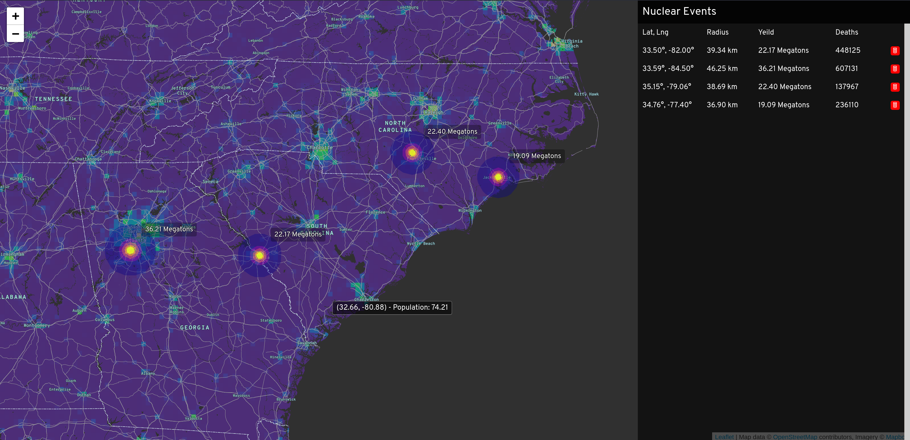

## Nuclear Event Simulation


This is a quick and dirty React experiment which models the loss of life for a given area based on [NASA SEDAC](https://sedac.ciesin.columbia.edu/) population data from 2020. This was produced as an exploration of data and interactivity with maps for professional purposes and should not be interpreted as nefarious in any way.

### Usage

To drop a bomb hold `ctrl`, then click and drag. Release at the desired radius.

<p align="center">
  
</p>

### Build / Run:

You'll need your own MapBox token.

- sign up at [MapBox](https://www.mapbox.com/)
- go to the [Account](https://account.mapbox.com/) page
- look under **Access Tokens** and copy the token
- create a file in the root of this repo called `.env.local`

The contents of `env.local` should look like:

```
REACT_APP_TOKEN=<your token here>
```

Then run:

- `npm install`
- `npm run start`

---

### FIXME:

- [ ] distance calculation does not respect zoom level

### TODO:

- [ ] animate detonations
- [ ] implement API (users, track detonations, load GeoTIFF layers from S3)
- [ ] implement realtime (websockets) multi-user interactivity
- [ ] implement weather effects modeling (radition / fallout)
- [ ] implement water system contamination modeling
- [ ] implement electrical grid disruption modeling
- [ ] implement supply chain disruption modeling (air / rail / road)
- [ ] implement agricultural output impact modeling
- [ ] implement defensive response time / distance modeling (military, police?)
- [ ] implement emergency response time / distance modeling (FEMA)

---

### Sources and Notes:

#### Libraries

- React, Redux, etc.
- Leaflet, Leaflet React for mapping
- Tuft.js for GeoJSON geometry
- GeoTIFF (geoblaze, georaster) for population data mapping
- D3, mostly for color and opacity scales

#### Blast Calculations

Extracted the weapons effect simulation page on [MIT Nuclear Weapons Education Project](https://nuclearweaponsedproj.mit.edu/nuclear-weapon-effects-simulations-and-models/nuclear-weapons-blast-effects-calculator) site.

#### Population Data

Included under `./public`.

- `Format` GeoTIFF, WGS84 (Lat / Lng)
- `Year` 2020
- `Resolution` 2.5 min
- `Source` NASA SEDAC, Gridded Population of the World (GPW), v4
- `URL` https://sedac.ciesin.columbia.edu/data/set/gpw-v4-population-count-rev11/data-download

#### Converting GeoTIFFs to Cloud Optimized TIFF (cog):

In almost all cases, you'll want to do this with a new GeoTIFF. These files can contain a massive amount of data. Optimization significantly improves render time across zoom levels.

```
docker run --rm \
  -v $PWD/public:/public osgeo/gdal:alpine-small-latest \
    gdal_translate \
      /public/gpw_v4_population_count_rev11_2020_2pt5_min.tif \
      /public/gpw_v4_population_count_rev11_2020_2pt5_min.cog.tif \
      -co TILED=yes -co COMPRESS=DEFLATE

docker run --rm \
  -v $PWD/public:/public osgeo/gdal:alpine-small-latest \
    gdaladdo -r average \
      /public/gpw_v4_population_count_rev11_2020_2pt5_min.cog.tif 2 4 8 16 32
```

### License

MIT
